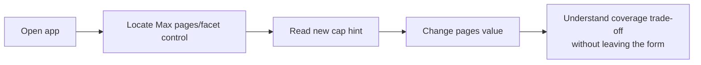

# Dogfood Report: trial/facet-cap-hint

- **Date:** 2026-07-05
- **Branch:** trial/facet-cap-hint (vs main)
- **Commit under test:** 10a426c

## Diff Summary

Single-file copy change: `app/page.tsx` (+4 lines). Adds a muted hint under the
"Max pages/facet" select explaining the ~10 reviews/page density and Amazon's
~100-reviews-per-facet serving cap, so users understand why 10 pages is labeled
"(Amazon max)".

## Personas

- **Seller-researcher (primary):** Amazon seller doing competitor review research
  (`docs/personas/PERSONAS.md`). Cares about extraction-completeness honesty (the
  ~100/facet cap), clear failure modes, zero re-work. Known paper cut this diff
  targets: the facet-cap interaction was unexplained at point of use.

## Flows Tested

## Test Matrix & Results

| # | Flow | Journey/Scenario | Status | Issue | Fix | Commit |
|---|------|------------------|--------|-------|-----|--------|
| 1 | Settings comprehension | Hint renders under select, accurate copy, muted style (desktop) | Pass | | | |
| 2 | Settings comprehension | Settings grid layout intact with hint (desktop) | Pass | | | |
| 3 | Settings comprehension | Mobile (~375px): hint wraps cleanly, no horizontal scroll | Pass | | | |
| 4 | Settings comprehension | Select still functional; hint constant across values | Pass | | | |
| 5 | Cross-cutting | No console/page errors on load + interaction | Pass | | | |
| 6 | Experiential | Seller-researcher persona walk: cap comprehension, new paper cuts | Pass | Minor terminology drift (see Paper Cuts) | | |

### Evidence notes

- S1: agent-browser snapshot shows the hint StaticText immediately after the
  Max pages/facet combobox; computed style check confirms `className: "muted"`,
  `color: rgb(139, 151, 173)` — identical to field-label muted color; 14px.
- S2: desktop (1280×800) screenshot
  (`assets/2026-07-05-facet-cap-hint-desktop.png`) — grid intact, hint sits
  between the select and the cookie field with normal spacing.
- S3: mobile (375×812) screenshot
  (`assets/2026-07-05-facet-cap-hint-mobile.png`) — hint wraps to 3 lines;
  `document.documentElement.scrollWidth === 375 === innerWidth` (no horizontal
  scroll).
- S4: `agent-browser select` 10→2→10; select value verified `"2"` then `"10"`
  via DOM eval; hint present and unchanged throughout. (An earlier
  `agent-browser fill` attempt cleared the selection — that was a test-driver
  misuse of `fill` on a `<select>`, reproduced identically on a fresh load and
  resolved by using the dedicated `select` command; not an app defect.)
- S5: `agent-browser errors` empty; console shows only the React DevTools info
  notice; Next.js dev server logs show no errors (all requests 200).

## What Was Fixed

None — all scenarios passed with zero app-code changes during the run.

## Paper Cuts

**Seller-researcher persona:**

1. **Terminology drift, minor:** the page intro says Amazon caps at "~100 results
   *per filter*", while the control label and new hint say "*facet*". Same
   concept, two words; a skimming user could wonder whether filter ≠ facet.
   Product-voice call, outside this diff → logged under Decisions for a Human.
2. The known paper cut this diff targeted ("facet controls' effect on the
   100-cap isn't explained at point of use") is resolved: the hint states the
   density (~10/page), the cap (~100/facet), and the consequence (10 pages =
   full coverage) exactly where the choice is made.

## Console Errors

None. Only `[info]` React DevTools suggestion (standard dev-mode notice).

## Human Verifications

None required — no auth, payments, email, or provider-side effects in scope.

## Decisions for a Human

1. **Align "per filter" vs "per facet" wording** between the intro paragraph and
   the settings control/hint (product-voice choice; one-line copy edit either way).
2. **`npm run lint` is broken repo-wide (pre-existing on main):** ESLint 9.39.2
   requires a flat `eslint.config.js` which the repo lacks. `npx next lint`
   passes clean (0 errors / 0 warnings). Not introduced by this branch; fix
   spun off as a separate task.

## Learnings

- `agent-browser fill` on a `<select>` clears the selection when the text
  doesn't exactly match an option; use the dedicated `select <sel> <val>`
  command for dropdowns.
- With another session's dev server on the default port, pin the dogfood server
  to its own port (3457 here) via a launch config in the session-level
  `~/.claude/launch.json` (the preview harness reads the session cwd's config,
  not the repo's — a repo-level `.claude/launch.json` was ignored).

## Final Status

**Ready.** 6/6 scenarios Pass, 0 fixes needed, no console or server errors.
Automated suite: `npm run build` ✅ (all routes compile), `npx next lint` ✅
(0 errors / 0 warnings), `npm run lint` ❌ pre-existing repo-wide config gap
(fails identically on main; tracked separately). `npm run test:engine` not run —
it performs live Amazon fetches requiring a real session cookie (network-side
effect, not exercised by this copy-only diff).
